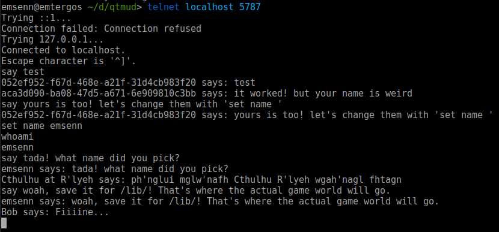

# Qualities of Things Multi-User Dimension
## (qtmud)

qtmud is a early alpha engine for maintaining and presenting a text-based MMORPG.

### Core Concepts

In qtmud, a manager controls game `services`, which act upon `things`.

`services` have `tick()` functions, which get sent any `events` the `service` 
was `subscribed` to with the `manager`.

Most `events` interact with `things`, which are instances of the `Thing` 
class, that have had `qualities` applied to them.

---

In practice, that when you execute `./run.py`, a `manager` is instanced.  
In turn, it starts some services, including the `MUDSocket` service.

The `MUDSocket` service runs a socket server. When `MUDSocket` receives 
a new connection, it asks the `manager` to create a new `thing`, and gives 
that `thing` these `qualities`:

* `Client` - tells the `MUDSocket` this thing is associated with the
connection, so that `MUDSocket` can pass messages back and forth between 
the socket connection and the client's `thing`.

* `Renderable` - gives the client's `thing` a name and description, which is 
used in various outputs.

* `Physical` - gives the client's `thing` a location, which in turn is any 
sort of `thing` with the `Container` quality.

After a client is assigned their `thing`, they're put in another `thing` 
with the `Room`, `Container`, and `Renderable` qualities.

Right now, all this enables is for two clients to `say` words at each other, 
handled by the `manager`. There isn't movement, inventories, or anything 
resembling actual gameplay at this point:

### Current Gameplay

This pretty much sums up everything you can do with qtmud right now. The full 
list of commands is:

* `whoami` tells the client their `name`. (until the client uses `set name`, 
this will be equivalent to their `identity`, a UUID.
* `whereami` tells the client the `name` of their `location`.
* `set <attribute> <value>` sets the client's `attribute`, if it exists, to 
`value`. The most practical use of this is `set name Earl`.
* `echo <text>` simply echos `text` back to the client.
* `say <text>` will pass `text` to every `Client` in the client's `location`,
formatted as `Earl says: Good morning!`

### Development

At this point in early development the API is quite volatile, so rely on 
the documentation at the function-level if you're having problems.
